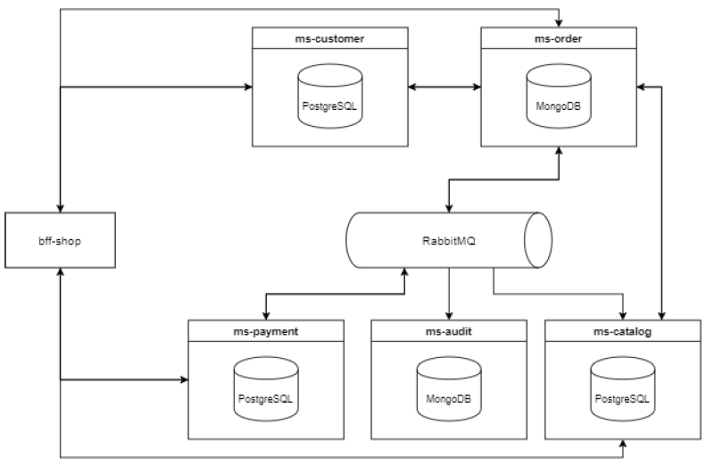

<p align="center"> 💻 Atualizado em 28 de Junho de 2022 💻</p>

<h1 align="center"> 🛒 Shop Style 🛒</h1>

<p align="center">
  

  

  <a href="https://github.com/gabrielcoelhox/course-angular-java/commits/main">
    
  </a>
</p>

[O Projeto](#id1)&nbsp;&nbsp;&nbsp;|&nbsp;&nbsp;&nbsp;
[MS Customer](#id2)&nbsp;&nbsp;&nbsp;|&nbsp;&nbsp;&nbsp;
[MS Catalog](#id3)&nbsp;&nbsp;&nbsp;|&nbsp;&nbsp;&nbsp;
[MS Payment](#id4)

# <a id="id1"> 💻 O Projeto </a>

O Shop Style é uma loja física que vende roupas de todos os tipos e estilos. Os fundadores do Shop Style desejam agora abrir uma loja virtual e contrataram uma equipe para implementar. Os arquitetos já desenharam a solução e agora cabe a você implementar essa solução.

O projeto usará uma arquitetura de micro-serviços. Foi definindo a criação de seis micro-serviços: customer, catalog, payment, order, audit e o bff-shop. Todos os micro-serviços devem ter testes unitários com cobertura de pelo menos 80% e também um swagger correspondente.



<details>
  <summary><strong><a id="id2"> <h1> 👨‍💼 MS Customer </h1></strong></summary>

O MS customer tem a responsabilidade de armazenar e gerenciar os dados de usuário e seus endereços. </br>
O MS customer possui os seguintes endpoints:

<details>
<summary><strong>Ver mais</strong></summary>

```bash
# POST - /v1/login

# POST - /v1/customers
# GET - /v1/customers/:id
# PUT - /v1/customers/:id
# PUT - /v1/customers/:id/password

# POST - /v1/address
# PUT - /v1/address/:id
# DELETE - /v1/address/:id
```

</details>

Campos da tabela customer:

```bash
ID, CPF, FIRST_NAME, LAST_NAME, SEX, BIRTHDATE, EMAIL, PASSWORD, ACTIVE
```

Campos da tabela address:

```bash
ID, STATE, CITY, DISTRICT, STREET, NUMBER, CEP, COMPLEMENT, CUSTOMER_ID
```

#### ❗ Observação

- O campo ID de todas as tabelas deve ser gerado por auto incremento.

Exemplo de um payload para cadastrar um cliente:

<details>
<summary><strong>Ver mais</strong></summary>

```bash
{
"firstName": "Maria",
"lastName": "Oliveira",
"sex": "Feminino",
"cpf": "000.000.000-00",
"birthdate": "00/00/0000",
"email": "maria@email.com",
"password": "12345678",
"active": true
}
```

</details> 
  
#### ☑️ Validações necessárias
- Os campos firstName e lastName precisam ter no mínimo 3 caracteres.
- O campo sex só pode ter duas opções disponíveis Masculino e Feminino, caso contrário informar um erro ao usuário.
- O campo email precisa estar no formato de um email válido e não deve permitir emails duplicados.
- O campo cpf precisa seguir o seguinte padrão (xxx-xxx-xxx-xx).
- O campo password precisa ter no mínimo 6 caracteres e tem que ser salva criptografada no banco.
- O campo birthdate precisa ser salvo no banco como o tipo date e tem que estar no formato [ISO-8601], entretanto na hora de serializar o objeto e enviar no payload do response esse campo precisa estar no formato dd/mm/aaaa.
- O campo active deve aceitar apeans valores booleanos.

Exemplo de um payload para cadastrar um endereço:

<details>
<summary><strong>Ver mais</strong></summary>

```bash
{
"state": "Ceará",
"city": "Fortaleza",
"district": "Conjunto Ceará",
"street": "Rua 202B",
"number": "902",
"cep": "60530-280",
"complement": "",
"customerId": 1
}
```

</details>

#### ❗ Observação

- No endpoint _**/v1/customers/:id**_ além de retornar os dados do cliente deve trazer todos os seus endereços.
- Usar o PostgreSQL.

#### ☑️ Validações necessárias

- Todos os campos são obrigatórios exceto o campo complement.
- Todos os campos são texto.
- O campo state só deve aceitar valores de um dos 27 estados brasileiros, qualquer outro valor deve retornar um erro.
</details>

<details>
  
<summary><strong> <a id="id3"> <h1> 🔖 MS Catalog </h1> </strong></summary>

O MS catalog é o responsável por armazenar os produtos, skus e categorias que vão estar disponíveis na aplicação. Um produto tem um ou mais skus e está vinculado a uma categoria e uma categoria pode ter zero ou mais produtos. Uma sku tem uma ou mais medias e uma media é de uma sku. O MS catalog possui os seguintes endpoints:

<details>
<summary><strong>Ver mais</strong></summary>

```bash
# POST - /v1/products
# GET - /v1/products
# GET - /v1/products/:id
# PUT - /v1/products/:id
# DELETE - /v1/products/:id

# POST - /v1/skus
# PUT - /v1/skus/:id
# DELETE - /v1/skus/:id

# POST - /v1/categories
# GET - /v1/categories
# GET - /v1/categories/:id/products
# PUT - /v1/categories/:id
# DELETE - /v1/categories/:id
```

</details> 
  
Campos da tabela product:
```bash
ID, NAME, DESCRIPTION, BRAND, MATERIAL, ACTIVE, CATEGORY_ID
```  
Campos da tabela sku:
```bash
ID, PRICE, QUANTITY, COLOR, SIZE, HEIGHT, WIDTH, PRODUCT_ID
```
Campos da tabela media:
```bash
ID, IMAGE_URL, SKU_ID
```
Campos da tabela category:
```bash
ID, NAME, ACTIVE, PARENT_ID
```
#### ❗ Observação
- O campo ID de todas as tabelas deve ser gerado por auto incremento.
  
Exemplo de um payload para cadastrar um produto:
<details>
<summary><strong>Ver mais</strong></summary>

```bash
{
"name": "Camisa Oficial do Fluminense",
"description": "A camisa pra você que é tricolor de coração",
"brand": "Umbro",
"material": "Algodão"
"active": true,
"categoryId": 1
}
```

</details> 
  
Exemplo de um payload para cadastrar uma sku:
<details>
<summary><strong>Ver mais</strong></summary>
  
```bash
{
"price": 249.99,
"quantity": 10,
"color": "tricolor",
"size": "M",
"height": 100
"width": 80
"images": ["http://example.com/image-1.png", "http://example.com/image-2.png", "http://example.com/image-3.png"]
"productId": 1
}
```
</details>
  
Exemplo de um payload para cadastrar uma categoria principal:
  
<details>
<summary><strong>Ver mais</strong></summary>

```bash
{
"name": "Camisas",
"active": true
}
```

</details>

Exemplo de um payload para cadastrar uma categoria filha:

<details>
<summary><strong>Ver mais</strong></summary>

```bash
{
"name": "Camisas de Futebol",
"active": true
"parentId": 1
}
```
</details>
  
### ☑️ Validações necessárias
- Os campos name , description , brand , active e categoryId são obrigatórios para salvar um produto.
- As categorias têm que estar ativa para um produto ser salvo.
- Produtos só podem ser salvos em categorias ativas e que não tem nenhum filho.
- Todos os campos mostrados acima são obrigatórios para cadastrar uma sku.
- Os campos height e width da sku tem que ser enviado em centímetros.
- Os campos name e active são obrigatórios para salvar uma categoria.

No endpoint GET - /v1/categories o retorno deve ser em formato de árvore, segue um exemplo logo abaixo:

<details>
<summary><strong>Ver mais</strong></summary>

```bash
[
  {
  "id": 1,
  "name": "Masculino",
  "active": true,
  "children": [
    {
      "id": 2,
      "name": "Roupas",
      "active": true,
      "children": [
        {
          "id": 3,
          "name": "Futebol",
          "active": true
        },
        {
          "id": 4,
          "name": "Elegante",
          "active": true
        }
      ]
    }
  ]
},
{
  "id": 5,
  "name": "Feminino",
  "active": true,
  "children": [
    {
      "id": 6,
      "name": "Roupas",
      "active": true,
      "children": [
        {
        "id": 7,
        "name": "Usual",
        "active": true
        },
        {
        "id": 8,
        "name": "Elegante",
        "active": true
        }
      ]
    }
  ]
},
]
```

</details>

O ms-catalog deve escutar as mensagens enviadas via RabbitMQ pelo ms-order para diminuir o estoque das skus, a mensagem enviada pelo ms-order possui o seguinte formato:

<details>
<summary><strong>Ver mais</strong></summary>

```bash
{
  "orderId": "6294d4b66f71221237b4d211",
  "skus": [
    {
      "id": 1,
      "quantity": 1
    },
    {
      "id": 2,
      "quantity": 5
    }
  ]
}
```

</details>
  
#### ❗ Observações
- Usar PostgreSQL e RabbitMQ.
- O endpoint __GET - /v1/products/:id__ além de retornar as informações do produto, tem que listar todas as suas skus.
- Ao desativar uma categoria todas as suas categorias filhas serão desativadas.
  
</details>
  
<details>
  <summary><strong><a id="id4"> <h1> 💵 MS Payment </h1></strong></summary>

O MS Payment é o responsável por gerenciar todos os métodos de pagamentos disponíveis. O MS Payment possui os seguintes
endpoints:
    
 <details>
<summary><strong>Ver mais</strong></summary>

```bash
# POST - /v1/payments
# GET - /v1/payments
# PUT - /v1/payments/:id
# DELETE - /v1/payments/:id

# POST - /v1/installments
# PUT - /v1/installments/:id
# DELETE - /v1/installments/:id
```
</details> 
  
Campos da tabela payments:
```bash
ID, TYPE, INSTALLMENTS, ACTIVE
```  
Campos da tabela installments::
```bash
ID, AMOUNT, BRAND, PAYMENT_ID
``` 
#### ❗ Observação
- O campo ID de todas as tabelas deve ser gerado por auto incremento.
    
Exemplo de um payload para cadastrar um método de pagamento:
<details>
<summary><strong>Ver mais</strong></summary>

```bash
{
"type": "credit card",
"installments": true,
"active": true
}
``` 
</details>
    
### ☑️ Validações necessárias
- Todos os campos são obrigatórios.
    
Exemplo de um payload para cadastrar a quantidade de parcelas disponíveis naquele método de pagamento:
<details>
<summary><strong>Ver mais</strong></summary>

```bash
{
"amount": 5,
"brand": "mastercard"
"paymentId": 1
}
``` 
</details>
    
### ☑️ Validações necessárias
- O campo brand não é obrigatório.
- Tem que validar se o installments do paymentId informado é true.
  
O ms-payment deve escutar as mensagens enviadas via RabbitMQ pelo ms-order com relação ao processamento de pagamento
de um pedido. Os ms-payment deve processar essa mensagem que possui o seguinte formato:
<details>
<summary><strong>Ver mais</strong></summary>

```bash
{
  "orderId": "6294d4b66f71221237b4d211",
  "payment": {
  "id": 1,
  "installments": 0
  }
}
``` 
</details>   
    
Depois de realizar o processamento da mensagem o ms-payment deve retornar o resultado, que possui o seguinte formato:
<details>
<summary><strong>Ver mais</strong></summary>

```bash
{
"orderId": "6294d4b66f71221237b4d211",
"status": "PAYMENT_SUCCESSFUL"
}
``` 
</details>   
  
Os possíveis status que o ms-payment pode enviar para o ms-order são os seguintes:
- Pagamento realizado com sucesso - *__PAYMENT_SUCCESSFUL__*
- Pagamento não existe no banco - *__PAYMENT_NOT_FOUND__*
- Pagamento está inativado - *__PAYMENT_INACTIVE__*
- Pagamento não aceita parcelamento - *__PAYMENT_NOT_INSTALLMENT__*
- As parcelas informadas não estão dentro do limite definido - *__PAYMENT_AMOUNT_NOT_AVAILABLE__*
    
#### ❗ Observação
Usar PostgreSQL e RabbitMQ.

[ISO-8601]: https://pt.wikipedia.org/wiki/ISO_8601